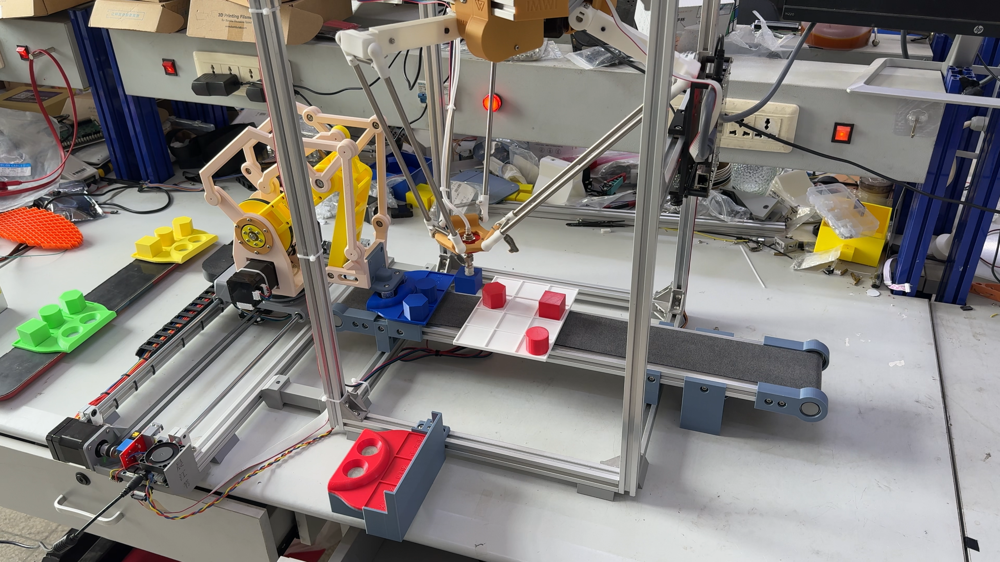
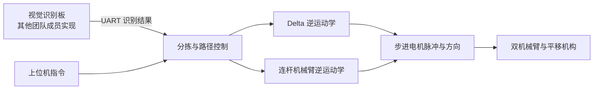

# 双机械臂机械结构设计与 FPGA 逆运动学实现

**Mechanical Design and FPGA Inverse Kinematics for a Dual-Arm Robot**

**第九届全国大学生集成电路创新创业大赛全国一等奖作品**

在这个项目中，我的主要工作是基于现有 STL 方案的机械结构补充设计，以及 Delta 并联机械臂和平行四边形连杆机械臂的逆运动学 FPGA 实现。本仓库围绕结构参数、数学模型、Verilog 定点计算与实物系统之间的对应关系整理。



> 摄像头采集与 FPGA 视觉识别由其他团队成员完成，本仓库保留运动控制侧的接口和系统背景，不包含视觉工程源码。两套机构基于网络 STL 方案，我补充了部分结构；仓库收录本人建模的 SolidWorks 源文件，详见[贡献与来源](docs/contributions.md)。

## 主要工作

- **机械结构补充设计**：基于网络 STL 机构方案补充结构并完成 SolidWorks 建模，结合分拣任务进行安装与配套设计。结构参数与解算代码对照展示。
- **两类机械臂逆运动学**：将目标空间坐标转换为驱动关节角度，再连接步进电机控制模块。
- **定点运算实现**：以整数缩放、位宽规划和移位处理实现原本的浮点计算；Delta 输入坐标采用 ×16 编码，电机角度采用 ×256 编码。
- **资源复用**：通过状态机调度乘法器，配合迭代开方和串行 CORDIC，在资源与计算延迟之间进行取舍。

仓库同时保存原项目中的线性插补、电机控制和串口等配套模块，以便理解完整调用链；这些文件的收录不代表其中每一行都是独立原创。

## 系统关系



## 结果与证据

以下 FPGA 数据来自比赛设计报告，是历史仿真与工程记录，并非本次重新上板测得。

| 项目 | 原报告结果 | 解释 |
| --- | --- | --- |
| Delta 完整逆解 | 50 MHz，235 个周期，约 4.7 μs | 算法解算耗时，不是机械臂完成运动的时间 |
| 单点角度对比 | 约 0.0048° 差异 | 坐标 (0, 0, −237.5 mm)，不是全工作空间最大误差 |
| 两套逆解算术资源 | 报告记录为 16 APM | 整机资源图显示 30/30 APM，不能混用统计范围 |
| 机械结构与实物 | 装配图、尺寸图、实物图 | CAD 来源与版本状态见 mechanical |


[查看验证记录与限制](docs/validation.md) · [阅读 FPGA 实现](docs/fpga-implementation.md)

## 从哪里开始

1. 阅读[机械结构设计](docs/mechanical-design.md)，了解尺寸与坐标约定。
2. 阅读[逆运动学说明](docs/inverse-kinematics.md)，对照公式与模块。
3. 在仓库根目录执行 Python 参考计算：

   ```sh
   python3 reference/delta_inverse.py --x 0 --y 0 --z -237.5
   ```

4. 使用 Pango Design Suite 打开 `fpga/pango/top_delta_ctrl.pds` 前，按[复现说明](docs/reproduce.md)生成乘法器 IP 并配置仿真库。

原 RTL 按比赛版本保存。当前整理版已检查文件来源、工程输入路径及 Python 样例；尚未重新完成 PDS 综合、HDL 仿真或实物测试。

## 目录

| 目录 | 内容 |
| --- | --- |
| `rtl/delta/` | Delta 逆解与配套控制 |
| `rtl/linkage_arm/` | 连杆机械臂逆解与配套控制 |
| `sim/` | 原比赛仿真源文件，按两套机械臂分开 |
| `reference/` | Python 参考计算及历史脚本 |
| `mechanical/` | 本人 SolidWorks 模型、外部模型清单和来源说明 |
| `fpga/pango/` | 调整路径后的集成工程、原约束与 IP 配置说明 |
| `docs/` | 设计说明、贡献说明、验证记录和原报告 |
| `assets/` | 从原设计报告提取的结构与验证图片 |

原设计报告见 [PDF](docs/report/CICC0900959_design_report.pdf) 和 [Word](docs/report/CICC0900959_design_report.docx)。报告描述整个团队系统；个人贡献以上述边界为准。原报告、代码与历史脚本中的差异已在文档中列出。

## 来源与使用说明

参见 [THIRD_PARTY_NOTICES.md](THIRD_PARTY_NOTICES.md)。本次整理没有替项目选择开源许可证；厂商专有 IP 源码未纳入，需在本地生成。机械模型保留原目录名称，以便追溯来源。
