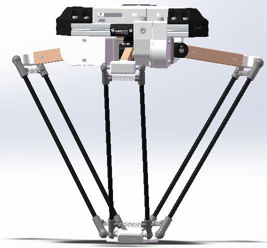
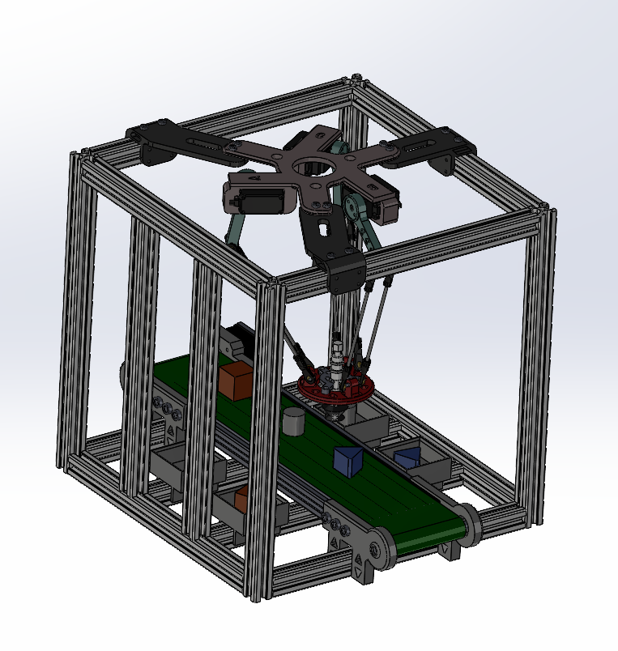
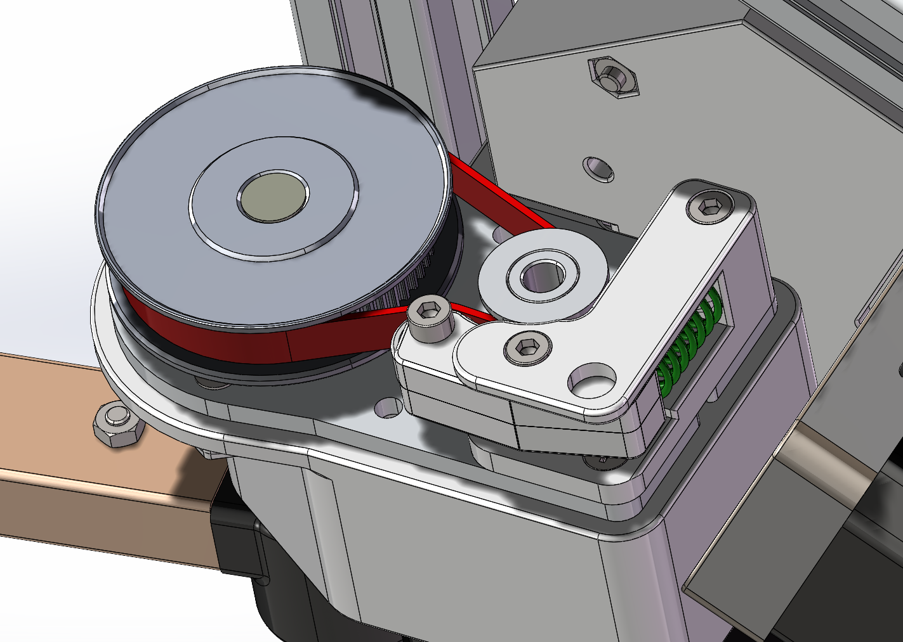
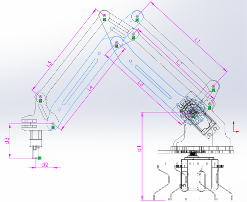

# 机械结构设计

两套机构基于网络 STL 方案，作者自行建模并补充部分结构。结构设计的展示重点是几何尺寸与算法参数的对应，以及两套机构如何配合分拣任务。图片均摘自原比赛设计报告，未重新渲染 CAD。

## Delta 并联机械臂

| 参数 | 数值 | 对应位置 |
| --- | --- | --- |
| 主动臂长度 m | 130 mm | `pretreat_data.v` 与原 Python 逆解 |
| 从动臂长度 n | 316 mm | 同上 |
| 静平台半径 R | 74.6920 mm | 同上 |
| 动平台半径 r | 34.6410 mm | 同上 |
| 铝型材框架 | 400 × 400 × 600 mm | 报告 3.2.1 |

报告给出的工作范围为 X/Y 约 −170 至 170 mm、Z 约 −400 至 −200 mm。这些数值不能当作长方体内每一点都可达的保证，还需考虑机构约束、碰撞与解的分支。

`pretreat_data.v` 中尺寸相关计算已经展开成整数常量，原注释明确指出修改尺寸 localparam 不会自动改变计算。更换结构时应重新推导全部相关常量并验证。

## 连杆机械臂与平移轴

平行四边形连杆机构用于托盘搬运，报告描述在三轴机构基础上增加 Y 方向平移轴以扩展工作范围。当前 `solver_big_and_small_arm.v` 中的参数为：大臂 150 mm、小臂 150 mm、起始升高量 95 mm、末端前伸量 65 mm、末端下降量 58 mm。调参时还需要同步检查长度平方与乘积常量。

## 模型归档

[mechanical](../mechanical/README.md) 保存原目录组织、CAD 文件清单和来源边界。SolidWorks 装配可能包含外部引用；本次没有使用 SolidWorks 打开重建，不保证归档中的装配引用全部完整，也没有将源文件改扩展名伪装为 STEP。

历史 `reference/legacy/delta_workspace_original.py` 使用 R=60、r=35、L=100、La=350，与上述比赛参数不同，且存在原有缩进问题。它仅作历史参考，不作为最终尺寸的验证依据。
