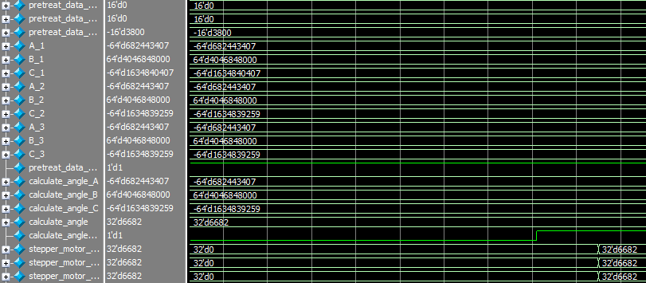
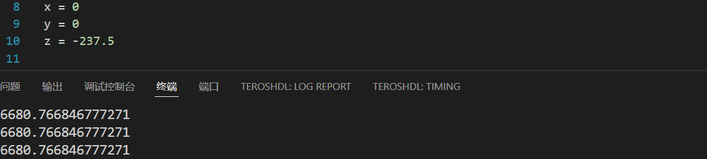
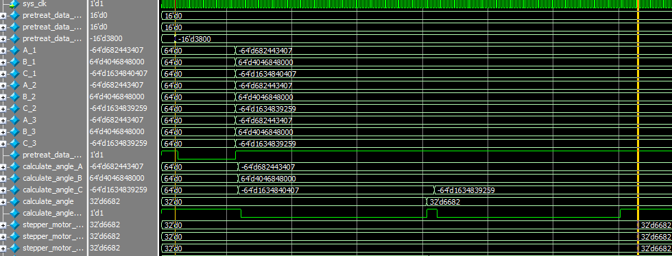
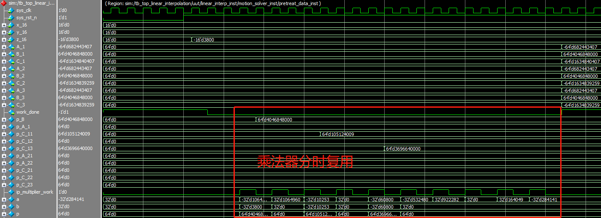
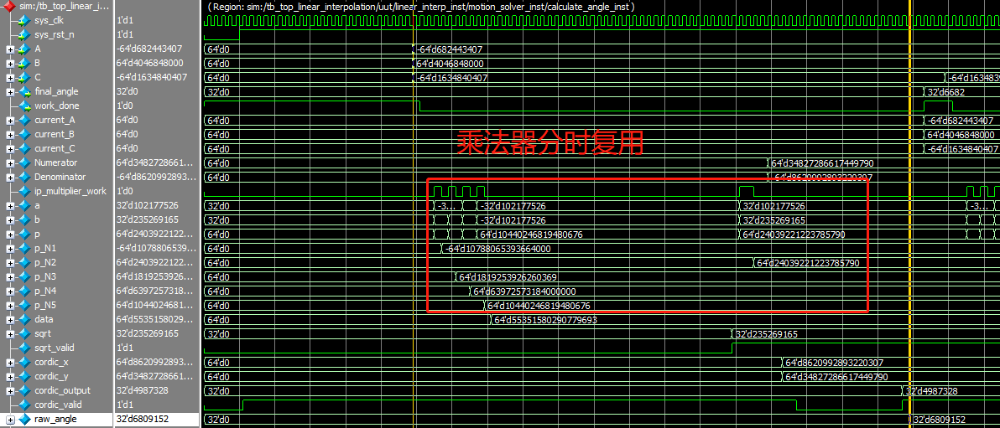
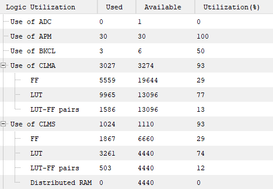

# 验证记录

## 历史报告证据

| 指标 | 来源 | 可得出的结论 |
| --- | --- | --- |
| Delta 235 周期 / 4.7 μs | 报告 4.1.3、图 4.1.5 | 原报告在 50 MHz 下记录的算法延迟 |
| 单点约 0.0048° 差异 | 图 4.1.3、4.1.4 | 仅对应 (0,0,−237.5 mm) 样点 |
| 两套逆解共 16 APM | 报告 4.1.4 文字 | 逆解模块统计，未由本次综合复核 |
| 整机 APM 30/30 | 图 4.1.8 | 整机统计，不是逆解模块统计 |

## 本次整理验证

执行结果保存在 [整理检查记录](organization-check.json)。检查范围是源文件校验、工程输入文件路径、Markdown 本地链接及 Python 样点。`source-manifest.json` 提供文件来源和摘要。

本机执行原 Python 逆解脚本，在 (0,0,−237.5 mm) 输出三轴 ×256 角度均为 `6680.766846777271`，对应约 `26.0967455°`。报告中的文字将该数字四舍五入为 `6680.77`，因此其后续换算会略有不同。RTL 输出 `6682` 是原报告记录，并非本次重新仿真产生。

本次未执行 PDS 综合、布局布线、HDL 仿真和硬件测试。原 `tb_motion_solver.v` 属于激励和波形观察型测试，不包含自动误差断言；现存默认输入也不是报告中的 −3800 样点。

## 后续验证的明确入口

- 使用原 `sim/delta/tb_motion_solver.v`，确认生成 IP 和仿真库后再运行。
- 为报告样点设置 `x_16=0, y_16=0, z_16=-3800`，检查内部角度输出，核对采样时刻。
- 扩充多个有效坐标、工作空间边界、不可达点、象限边界、复位及重复相同输入的用例。
- 分别报告算法最大角度误差、角度量化分辨率和实物位置误差，避免将三者混用。
- 分开记录独立逆解模块与整机的资源占用、时序约束和关键路径结果。
